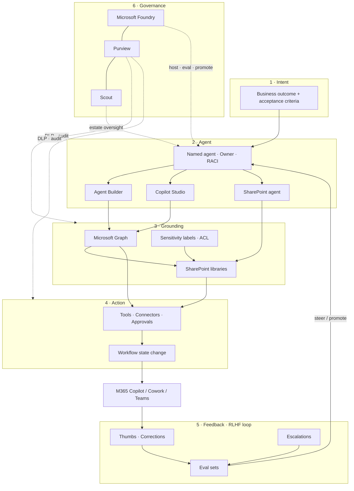
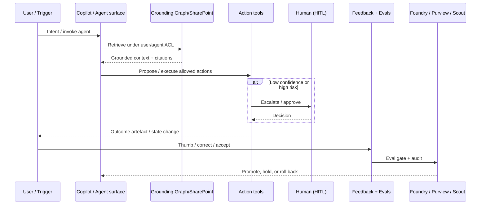

# The Effective Agents Framework

A practical stack for shipping outcome-oriented agents on Microsoft technologies.

**Primary tagline:** Ship Outcomes, Not Chat

---

## Layers

```
Intent → Agent → Grounding → Action → Feedback → Governance
```

| Layer | Question it answers | Failure mode if skipped |
|-------|---------------------|-------------------------|
| **Intent** | What outcome must be true when we stop? | Agents that chat forever |
| **Agent** | Who/what is accountable for the run? | Undifferentiated “Copilot soup” |
| **Grounding** | What may it know, under whose permissions? | Hallucinated policy; data leakage |
| **Action** | What may it change in the world? | Read-only theatre |
| **Feedback** | How do humans steer and improve it? | Static prompts; silent regression |
| **Governance** | Who may deploy, watch, and kill it? | Shadow agents; audit gaps |

### 1. Intent

Define the **done state** in business language before tools.

- Example intents: “Renewal pack assembled from approved SharePoint sources”, “Invoice exception triaged with rationale”, “Policy Q&A answered only from labelled libraries”.
- Capture acceptance criteria, SLAs, and escalation thresholds.
- Reject intents that are only “be helpful in chat”.

### 2. Agent

A named agent identity with scope, owner, and runtime.

- **SharePoint agents** for site- and library-scoped work
- **Microsoft 365 Copilot / Cowork** surfaces for user-adjacent runs
- **Copilot Studio** agents for multi-step orchestration and channels
- **Agent Builder** for composing agents in the Microsoft agent toolchain
- Clear RACI: business owner, platform owner, security reviewer

### 3. Grounding (SharePoint / Graph)

Knowledge and context bound by identity and labels.

- Microsoft Graph + SharePoint as primary corpus
- Respect existing ACLs, sensitivity labels, retention
- Prefer retrieval over stuffing; prefer citations over vibes
- Separate *reference* grounding (read) from *working set* (draft artefacts)

### 4. Action (Copilot Studio / Agent Builder)

Tools and connectors that change state.

- Create/update list items, files, planner tasks, approvals
- Call approved APIs via governed connectors
- Human-in-the-loop gates for irreversible or high-risk actions
- Idempotency and dry-run modes where possible

### 5. Feedback (RLHF-style human preference loops)

Preference signals from real work — not lab annotators alone.

| Signal | Source | Use |
|--------|--------|-----|
| Thumbs / ratings | Copilot / agent UI | Preference model / prompt ranking |
| Corrections | Edited drafts, rewritten classifications | Direct fine-tune / few-shot refresh / eval gold |
| Escalations | Routed to human queues | Calibrate confidence; expand policy coverage |
| Silent abandonment | User leaves mid-flow | Funnel analysis; intent mismatch |
| Eval sets | Curated hard cases | Regression gates before promote |

**RLHF in practice (enterprise):**

1. Log every agent run with inputs, retrieved sources, actions, and outcome.
2. Collect explicit preference (thumbs) and implicit preference (accepted vs edited artefact).
3. Sample disagreements into a weekly review (CoE + business owner).
4. Promote winning behaviours via prompt/version bump, tool policy, or Foundry evaluation pass.
5. Freeze failures into eval sets; block release if eval regresses.

Humans stay in the loop where judgement is scarce. The loop **trains and steers** — it is not an apology for a model that only chats.

### 6. Governance (Foundry, Purview, Scout)

Control plane for safe scale.

- **Microsoft Foundry (Azure AI Foundry):** model/agent hosting, evaluations, catalogues, environment promotion
- **Microsoft Purview:** DLP, audit, retention, sensitivity
- **Scout:** estate visibility and agent oversight patterns for Microsoft-centric orgs
- Change management: versioned agents, rollback, break-glass kill switch
- Access reviews for agent identities and connectors

---

## Microsoft product map

| Product | Framework role |
|---------|----------------|
| **SharePoint** | Grounding corpus; site/library-scoped agents; artefact store |
| **Microsoft Graph** | Permissions-aware retrieval and action APIs |
| **Microsoft 365 Copilot / Cowork** | Primary user surface; preference capture at point of work |
| **SharePoint agents** | Scoped agents living with content |
| **Copilot Studio** | Orchestration, topics/tools, channels, HITL |
| **Microsoft Agent Builder** | Composition and build path for agents on the Microsoft stack |
| **Microsoft Foundry** | Model/agent lifecycle, evals, governed deployment |
| **Purview** | Compliance and data governance envelope |
| **Scout** | Monitoring / discovery / oversight of agent behaviour at scale |
| **Entra ID** | Identity for users and agent principals |
| **Teams** | Collaboration surface and approval channels |

*Built on Microsoft technologies. Not affiliated with Microsoft.*

---

## Effectiveness metrics

Report these on a single page per agent (and rolled up for the estate).

| Metric | Definition | Target posture |
|--------|------------|----------------|
| **Task completion rate** | % of runs reaching the defined done state without human rewrite of the core artefact | Climb; segment by intent |
| **Time-to-outcome** | Median wall-clock from trigger to done state | Fall vs baseline manual process |
| **Escalation rate** | % of runs routed to human by design or by failure | Healthy band: not ~0% (overconfident) and not ~100% (useless) |
| **Confidence calibration** | When agent says high confidence, is it right? | Reliability diagrams; punish fluent wrongness |
| **Correction distance** | Edit distance / field-change count between agent draft and accepted version | Fall over time |
| **Grounding citation validity** | % of cited sources still ACL-visible and relevant | Stay high |
| **Policy incident count** | DLP / Purview / unsafe action events | Near zero; never trade for speed |
| **Cost per outcome** | Tokens + connector + human minutes / completed outcome | Fall; never optimise alone |

**Anti-metrics (do not optimise alone):** message count, “Copilot adoption” seats, thumbs-up without task completion.

---

## Reference architecture (Mermaid)



### Runtime sequence (happy path)



---

## Operating rhythm

| Cadence | Activity |
|---------|----------|
| Daily | Monitor failures, DLP hits, escalation spikes |
| Weekly | Preference review; promote or revert agent versions |
| Fortnightly | Eval set expansion from novel failures |
| Quarterly | Estate Scout review; retire decorative agents; re-baseline metrics |

---

## Minimal viable effective agent (checklist)

- [ ] Intent written as a done state with owner
- [ ] Agent named; Entra-backed; RACI set
- [ ] Grounding limited to labelled SharePoint / Graph scope
- [ ] Actions listed; HITL on irreversible steps
- [ ] Thumbs + correction capture wired
- [ ] Eval set with ≥20 hard cases
- [ ] Foundry (or equivalent) promotion path
- [ ] Purview policies confirmed
- [ ] Scout / monitoring coverage
- [ ] Dashboard: completion, time-to-outcome, escalation, calibration
