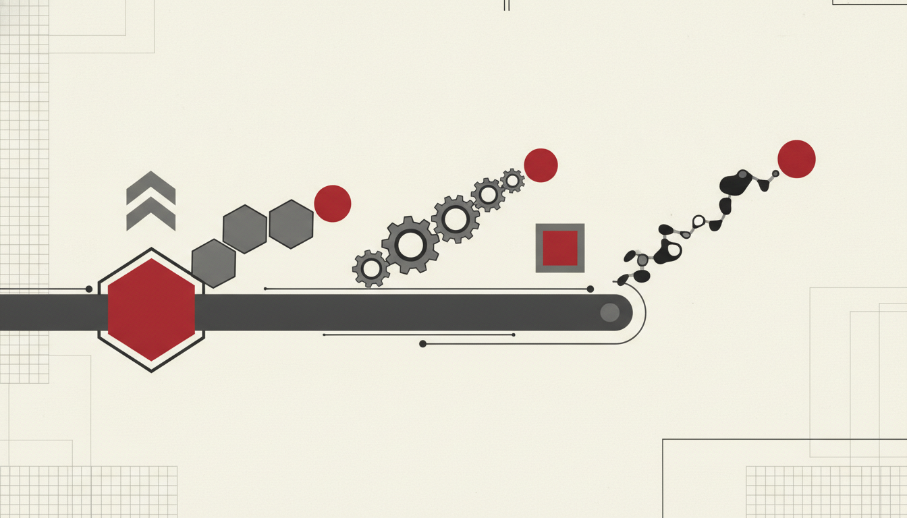
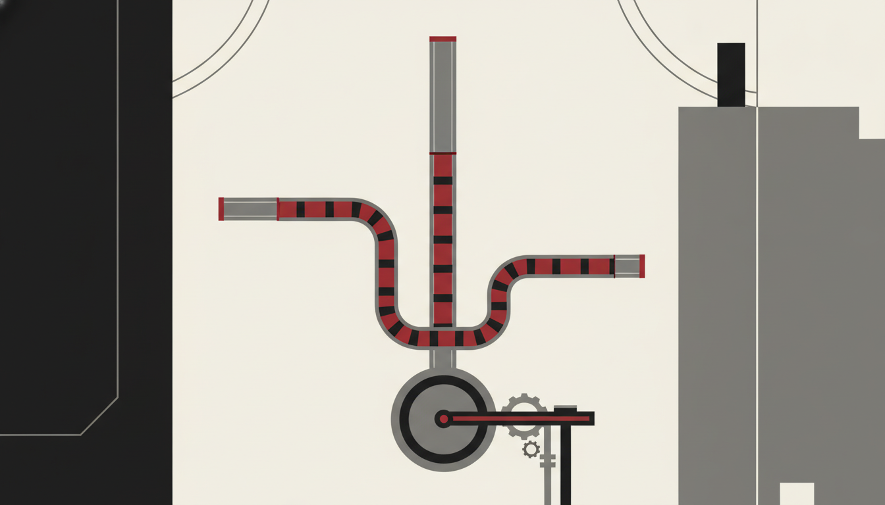

# Effective Choice

**Ship Outcomes, Not Chat**

Before you build another agent, **understand the work**. Map how work gets done, by whom, and which tasks move value — then work backwards to decide what to **augment**, **automate**, or **leave be**.

A related perspective on organisational understanding as a discipline sits at [organisationalunderstanding.com](https://organisationalunderstanding.com). Effective Agents offers a concrete method tuned to Microsoft 365 agents and Copilot programmes.

---

## The Effective Choice method

### 1. Inventory how work gets done

List the recurring flows that matter: intake → decide → produce → approve → file → notify. Capture systems of record (SharePoint libraries, lists, Dynamics, Service desks), artefacts, and SLAs. Ignore “nice chat ideas” until the flow is visible.

### 2. Map who does which tasks

For each step: role, volume, cycle time, error cost, and judgement intensity. Note hand-offs — agents fail most often at the seams between teams.

### 3. Score candidates (backwards from outcomes)

Work **backwards from the done state**. Ask:

| Question | Prefer |
|----------|--------|
| What must be true when we stop? | A filed artefact, updated case, recorded approval |
| Where does judgement concentrate? | Keep humans; augment with drafts and retrieval |
| Where is volume high and rules clear? | Automate with governed actions |
| Where is risk or rarity extreme? | Leave be — or human-only with better tooling |

### 4. Choose the intervention

| Choice | When | Typical Microsoft shape |
|--------|------|-------------------------|
| **Augment** | Humans stay accountable; AI accelerates drafts, search, triage | Copilot in apps; SharePoint agents for grounded Q&A with citations |
| **Automate** | Clear rules, reversible or gated actions, measurable completion | Copilot Studio / Agent Builder with connectors, approvals, audit |
| **Leave be** | High stakes, low volume, weak data, or political fragility | Improve process / training first; revisit later |

Build vs buy vs agent vs human is a **portfolio** decision, not a slogan. Many “agent” requests are really SharePoint hygiene, permissions, or workflow debt.

---

## Backwards design checklist

1. Write the outcome in business language (Intent).
2. Name the owner and runtime (Agent).
3. Bound what it may know (Grounding — Graph, labels, ACLs).
4. Bound what it may change (Action — connectors, human gates).
5. Define how preference corrects it (Feedback).
6. Define who may deploy, watch, and kill it (Governance).

If you cannot complete the chain, you do not yet have an agent candidate — you have a chat wish.

---

## Anti-patterns

- Starting from a blank chat window and hunting for a use case.
- Automating the noisiest meeting instead of the clearest workflow.
- Measuring success as “people opened Copilot” instead of “the case closed faster”.
- Skipping leave-be: not every task deserves an agent.

---

## How Choice feeds Insights and Measurements

Choice decides *where* to place agents. Insights show whether activation and maturity follow. Measurements prove board-grade value and risk. Together they keep programmes honest: **Ship Outcomes, Not Chat.**

**Next:** [Effective Insights](../insights/) · [Effective Measurements](../measurements/) · [Our Goal](../)
