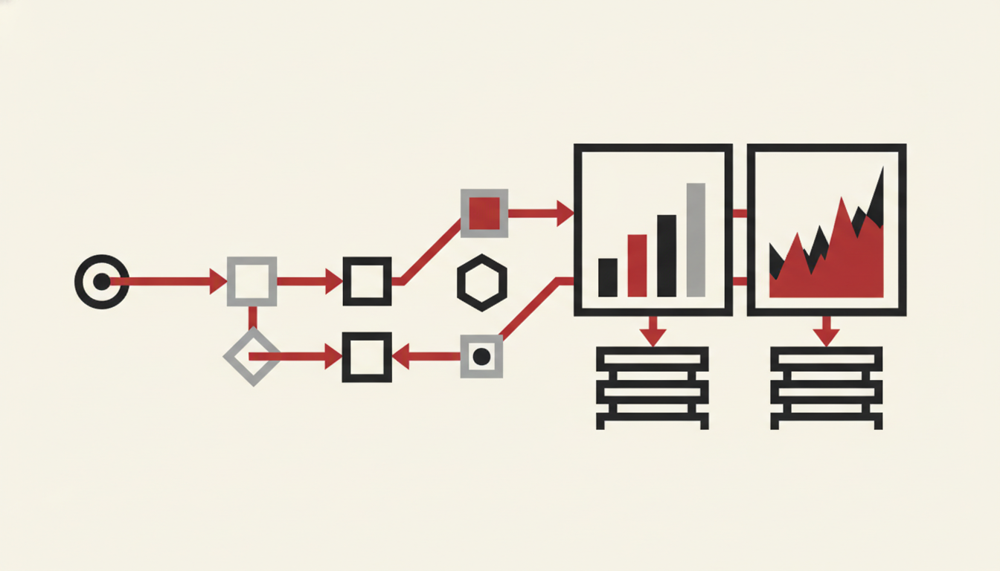

# Effective Measurements

**Ship Outcomes, Not Chat**

Board-ready measurement for AI and agents: **decision-first packs**, value beyond P&L, balanced lenses, one measurement chain, risk beside performance, evidence gates, a 90-day operating model, and anti-gaming discipline.


This page is an Effective Agents synthesis for Microsoft-centric estates. It attributes well-known frames by name (Balanced Scorecard thinking, NIST AI RMF concepts, DORA-style caution about metric theatre) without lifting third-party blueprints.

---

## Decision-first packs

Do not start with a metric catalogue. Start with the **decision** the pack must unlock:

| Decision | Pack answers | Lead metrics (examples) |
|----------|--------------|-------------------------|
| Renew / expand licences | Is assisted value beating cost? | Assisted £ vs consumption; activation |
| Scale an agent | Is it healthy and reused? | Resolution, return rate, versatility |
| Pause a pilot | Is maturity stuck on “asking”? | Maturity stage; time-to-outcome |
| Fund enablement | Who is ready but idle? | Readiness scores; active days |
| Accept residual risk | Are gates and escalations working? | Escalation rate; policy incidents |

If a chart does not change one of these decisions, cut it from the pack.

---

## Value beyond P&L

Boards need money stories — and more:

- **Throughput** — cycle time, backlog burn, cases closed per FTE
- **Quality** — rework rate, citation accuracy, policy exceptions
- **Experience** — employee effort, customer wait, CSAT where agents touch service
- **Risk & control** — audit completeness, DLP hits, shadow-agent count
- **Learning** — preference volume, eval pass rate, time-to-remediate

Assisted value (hours × rate) is necessary. It is not sufficient.

---

## Balanced lenses

Borrow the spirit of Balanced Scorecard: hold **financial, customer/employee, internal process, and learning** views in one pack. For agents, map roughly to:

| Lens | Agent-oriented view |
|------|---------------------|
| Financial | Assisted value, licence net, credit burn |
| Stakeholder | Adoption, satisfaction, trust (escalations accepted) |
| Process | Task completion, time-to-outcome, hand-off failures |
| Learning & governance | Eval sets, preference loops, NIST AI RMF–aligned controls |

Unbalanced packs create local optima (e.g. maximising prompts while quality collapses).

---

## One measurement chain



Keep a single spine from telemetry to board story:

```
Intent (done state)
  → Agent runs (identity, grounding, actions)
  → Telemetry (actions, sessions, outcomes, feedback)
  → Operational KPIs (completion, escalation, health)
  → Value model (hours / assisted £)
  → Decision pack (renew, scale, fix, stop)
```

Break the chain and you get incompatible numbers across CoE, finance, and security.

Tie every KPI to the Effective Agents framework: **Intent → Agent → Grounding → Action → Feedback → Governance**.

---

## Risk beside performance

Never present green ROI without a risk pane:

- Permission overreach / grounding leakage
- Hallucinated policy used as fact
- Irreversible actions without human gates
- Drift against eval sets
- Unregistered agents (Scout / estate visibility)

Align language to **NIST AI RMF** categories (map, measure, manage, govern) so risk and performance share a vocabulary with security and audit.

---

## AI evidence gates

Before promoting an agent (or claiming ROI):

1. **Intent gate** — written done state and acceptance tests
2. **Eval gate** — hard-case set passes; no silent regression
3. **Preference gate** — corrections flowing; owners reviewing weekly
4. **Control gate** — Purview / DLP / audit paths verified
5. **Value gate** — measurement chain populated for ≥ one reporting cycle

No evidence, no expansion narrative.

---

## 90-day operating model (summary)

| Days | Focus | Exit criteria |
|------|-------|---------------|
| **0–30** | Instrument & baseline | Telemetry wired; decision packs drafted; leave-be list agreed |
| **31–60** | Pilot with gates | 1–3 agents through evidence gates; first preference review |
| **61–90** | Prove & productise | Board pack with value + risk; scale / fix / stop decisions recorded |

Cadence: weekly CoE ops, monthly sponsor pack, quarterly board pack. Do not invent a second metric religion mid-flight.

---

## Anti-gaming (DORA-style caution)

What gets measured gets gamed. Watch for:

| Temptation | Distortion | Counter |
|------------|------------|---------|
| Message / prompt counts | Chat theatre | Prefer completion & time-to-outcome |
| Hours saved without baselines | Inflated ROI | Publish baseline sources; sensitivity bands |
| Forced thumbs-up | Fake preference | Sample corrections and escalations |
| Hiding escalations | Silent risk | Escalation rate as a *health* metric, not shame |
| Licence seats as success | Shelfware | Activation and active days |

Treat metrics as **hypotheses under review**, not trophies.

---

## Closing

Effective Measurements exists so **Ship Outcomes, Not Chat** is auditable. Insights show the estate. Choice picks the work. Measurements decide funding with eyes open.

**Next:** [Effective Insights](../insights/) · [Effective Choice](../choice/) · [Our Goal](../)
